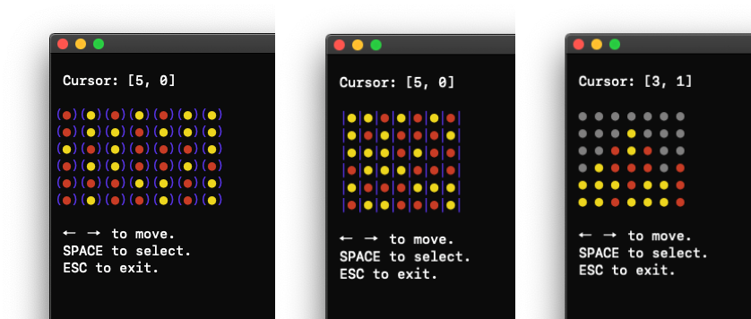

# connect-four.py

[Board games collection repo](https://github.com/956MB/board-games)

```
                                            this is nothing
. . . . . . .         . . . . . . .         ┌─┬─┬─┬─┬─┬─┬─┐
. . . . . . .    │    . . . ● . . .    │    ├─┼─┼─┼─┼─┼─┼─┤
. . ● ○ . . .    │    . . ● . . . .    │    ├─┼─┼─┼─┼─┼─┼─┤
○ ● ○ ● . . .    │    . ● . . . . .    │    ├─┼─┼─┼─┼─┼─┼─┤
● ○ ○ ○ ● . .    │    ● . . . . . .    │    ├─┼─┼─┼─┼─┼─┼─┤
● ○ ○ ● ● ○ ●         . . . . . . .         ├─┼─┼─┼─┼─┼─┼─┤
                                            └─┴─┴─┴─┴─┴─┴─┘
⭠ ⭢  to move.          WINNER: ●
SPACE to select.
ESC to exit.
```

Usage:

```shell
usage: connect-four.py [-h] [-V] [-n] [-r] [-d DATASET] [-s [{1,2,3}]] [-l]

Play Connect Four in the terminal. Written in Python.

optional arguments:
  -h, --help            show this help message and exit
  -V, --version         show script version
  -n, --net             play against trained neural net
  -r, --random          play against random moves
  -d DATASET, --dataset DATASET
                        path to .csv moves dataset to load random game
  -s [{1,2,3}], --style [{1,2,3}]
                        style of Connect Four game. 1, 2 or 3.
  -l, --log             log moves of game to logs/
```

### 'test-output-moves.csv' dataset format:

```
[starter, moves..., winner]

Starter: The first moves piece color that was randomly picked (1 or -1, for red/yellow)
Moves: Integer made from array row/col of where the moves were placed ([5,5] = 55, [5,3] = 53, etc...)
Winner: Winner of the game (1 or -1, for red/yellow)

Example:

[1],(55),53,50,45,43,33,56,51,40,30,35,54,44,34,25,52,{-1}

[]: red went first, (): red first move 55, {}: yellow ended up winning
```

# TODO:

* Finish implementing argument features for play.py:
    * --net, figure out neural net stuff to make moves in connect four. wow, difficult.
    * --log, log things like total moves, red/yellow moves, time/date, win method

# LOOKS:

